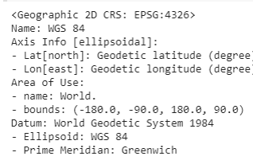

# USING GEOPANDAS AND FOLIUM IN TANDEM: A GEOSPATIAL EXPLORATION IN RETROGRADE
A tutorial/interactive experience for using both GeoPandas and Folium libraries. According to Astell-Burt et al. (2014), lack of green space accessibility and the inequitable distribution of parks is likely to exacerbate health inequalities and crime levels. Worcester, Massachusetts is considered an environmental justice zone with a high population of citizens with an average household income well below the state average, an average education level below the state average and high renter population. In this tutorial, we will be re-creating a geospatial vector analysis comparing the number of households in Worcester with no access to a vehicle and the locations of open space.

Created by: Rachel Corcoran-Adams for IDCE 30274, November 2020

In this tutorial, we will be exploring the ways in which 'geopandas', and 'folium' can be used in Python to pre-process, geoprocess and display vector shapefiles. 

### Data
Data for this tutorial can be obtained from the 'data' folder of this repository. In this folder, there are shapefiles downloaded from:
Census tract town boundaries of Worcester, MA - [here](https://docs.digital.mass.gov/dataset/massgis-data-community-boundaries-towns-survey-points)
Open space data from MassGIS - [here](https://docs.digital.mass.gov/dataset/massgis-data-protected-and-recreational-openspace)
Land cover (2016) from MassGIS - [here](https://docs.digital.mass.gov/dataset/massgis-data-2016-land-coverland-use)
American Community Survey 2014-2016 from the Living Atlas - [here](https://www.arcgis.com/home/item.html?id=9a9e43ec1603446880c50d4ed1df2207)

# Part 1: Importing
```python
!pip install geopandas
!pip install gdal
!pip install rtree
!apt-get install -y libspatialindex-dev
!install -g topojson
import gdal
import matplotlib.pyplot as plt
import rtree
import folium
import os
import json
from folium import plugins
import geopandas as gpd
from shapely.geometry import Point, Polygon, MultiPolygon
from shapely import wkt
```
Importing data to Google Drive helps when working with Google Colab.
```python 
# import files from Drive
from google.colab import drive
drive.mount('/content/gdrive')
# set root path
root_path = 'gdrive/My Drive/GIS/final_project/'
```
# Part 2: Data Pre-Processing
```python
# import all of the shapefiles 
open_space = gpd.read_file(root_path+'open_space_clipped_1.shp')
ACS_Worcester = gpd.read_file(root_path+'ACS_Clipped_final_1.shp')
census_tracts = gpd.read_file(root_path+'CENSUS2010TRACTS_POLY.shp')
census_towns = gpd.read_file(root_path+ 'CENSUS2010TOWNS_POLY.shp')
landcover = gpd.read_file(root_path+ 'landcover_clipped.shp')
vehicle_access = gpd.read_file(root_path+ 'vehicle_access.shp')
```
I then projected all of my shapefiles to EPSG:4326, which is the required coordinate system for geojson. 
```python
# project all the shapefiles 
open_space = open_space.to_crs("EPSG:4326")
ACS_Worcester = open_space.to_crs("EPSG:4326")
census_tracts = census_tracts.to_crs("EPSG:4326")
census_towns = census_towns.to_crs("EPSG:4326")
landcover = landcover.to_crs("EPSG:4326")
vehicle_access = vehicle_access.to_crs("EPSG:4326")
```
Check to see if it worked!
```python
#check to see if it worked!
open_space.crs
```
```python
#check to see if it worked!
ACS_Worcester.crs
```
```python
#check to see if it worked!
census_towns.crs
```
```python
#check to see if it worked!
landcover.crs
```
```python
#check to see if it worked!
vehicle.crs
```
This is the output:


