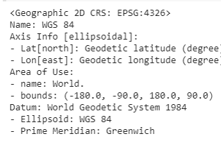
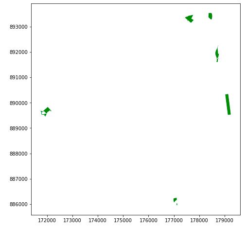
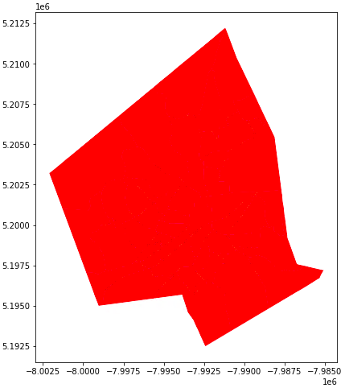
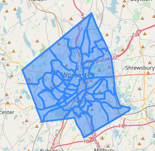

# Using GeoPandas and Folium in Tandem: A Geospatial Exploration using Retrograde Problem Solving
Created by: Rachel Corcoran-Adams for IDCE 30274, November 2020

A tutorial/interactive experience for using both GeoPandas and Folium libraries. According to Astell-Burt et al. (2014), lack of green space accessibility and the inequitable distribution of parks is likely to exacerbate health inequalities and crime levels. Worcester, Massachusetts is considered an environmental justice zone with a high population of citizens with an average household income well below the state average, an average education level below the state average and high renter population. In this tutorial, we will be re-creating a geospatial vector analysis comparing the number of households in Worcester with no access to a vehicle and the locations of open space.


In this tutorial, we will be exploring the ways in which 'geopandas', and 'folium' can be used in Python to pre-process, geoprocess and display vector shapefiles. 

### Data
Data for this tutorial can be obtained from the 'data' folder of this repository. In this folder, there are shapefiles downloaded from:
Census tract town boundaries of Worcester, MA - [here](https://docs.digital.mass.gov/dataset/massgis-data-community-boundaries-towns-survey-points)
Open space data from MassGIS - [here](https://docs.digital.mass.gov/dataset/massgis-data-protected-and-recreational-openspace)
Land cover (2016) from MassGIS - [here](https://docs.digital.mass.gov/dataset/massgis-data-2016-land-coverland-use)
American Community Survey 2014-2016 from the Living Atlas - [here](https://www.arcgis.com/home/item.html?id=9a9e43ec1603446880c50d4ed1df2207)

# Part 1: Importing
First download all the libraries that will be needed for this lab. **If you are not using Colab you may need to install pandas, if you're using Colab you don't because Pandas is already installed in the Google Colab Environment.**
```python
!pip install geopandas
!pip install gdal
!pip install rtree
!apt-get install -y libspatialindex-dev
!install -g topojson
import gdal
import matplotlib.pyplot as plt
import rtree
import folium
import os
import json
from folium import plugins
import geopandas as gpd
from shapely.geometry import Point, Polygon, MultiPolygon
from shapely import wkt
```
Importing data to Google Drive helps when working with Google Colab. I created a GIS folder within my Google Drive that stores all of my geospatial data. Within that folder I have a folder called 'final_project' that functions as a working folder for my ouputs.
```python 
# import files from Drive
from google.colab import drive
drive.mount('/content/gdrive')
# set root path
root_path = 'gdrive/My Drive/GIS/final_project/'
```

# Part 2: Data Pre-Processing
Once Colab is connected to your Drive, you're going to want to import your shapefiles. Again please note that if you are NOT using Colab you should NOT use this exact code to connect to your input data.
```python
# import all of the shapefiles 
open_space = gpd.read_file(root_path+'open_space_clipped_1.shp')
ACS_Worcester = gpd.read_file(root_path+'ACS_Clipped_final_1.shp')
census_tracts = gpd.read_file(root_path+'CENSUS2010TRACTS_POLY.shp')
census_towns = gpd.read_file(root_path+ 'CENSUS2010TOWNS_POLY.shp')
landcover = gpd.read_file(root_path+ 'landcover_clipped.shp')
vehicle_access = gpd.read_file(root_path+ 'vehicle_access.shp')
```
I then projected all of my shapefiles to EPSG:4326, which is the required coordinate system for geojson. The EPSG code 4326 is the specific code for the WGS 1984 CRS.
```python
# project all the shapefiles 
open_space = open_space.to_crs("EPSG:4326")
ACS_Worcester = open_space.to_crs("EPSG:4326")
census_tracts = census_tracts.to_crs("EPSG:4326")
census_towns = census_towns.to_crs("EPSG:4326")
landcover = landcover.to_crs("EPSG:4326")
vehicle_access = vehicle_access.to_crs("EPSG:4326")
```
Check to see if it worked!
```python
#check to see if it worked!
open_space.crs
```
```python
#check to see if it worked!
ACS_Worcester.crs
```
```python
#check to see if it worked!
census_towns.crs
```
```python
#check to see if it worked!
landcover.crs
```
```python
#check to see if it worked!
vehicle.crs
```
This should be the output:



# Part 3: Geoprocessing with GeoPandas
Now, we want to geoprocess our layers by using clip and select by attribute. This is basic map algebra and vector analysis. 
```python
# This line selects by attribute to create a worcester polygon
worcester = census_towns[census_towns['TOWN']=="WORCESTER"]
# This line clips the open space file to just include worcester
open_space_clipped = gpd.clip(open_space, worcester)
# This line selects by attribute for open space to include public access
open_space_select = open_space_clipped[open_space_clipped['PUB_ACCESS']=="Y"]
# This line selects only polygons with full public access and with primary purpose of recreation and conservation
pub_access_recreation = open_space_select[open_space_select['PRIM_PURP']== "B"] 
# This line will be selecting only the residential multi-family features in landcover 
landcover_residential = landcover[landcover['USEGENCODE']== "Residential-multi-family"]
```
# Part 6: Visualizing 
Now, we will be using the matplot library to help visualize what our finished layers look like individually. I personally prefer using another method to visualize multiple layers at once, so I will display my layers individualy for now just to ensure that the geoprocessing worked. 

```python
pub_access_recreation.plot(column='SITE_NAME', color='green', figsize=(16,8));
```
Your output should look like this:



What do we see in this map? Where are the distributions of public green space located predominately? Are they all in one area? 

```python
vehicle_access.plot(column='TARGET_FID', color='red', figsize=(16,8));
```
Your output should look like this:



Now, this does not show us a lot of information, right? In order to visulize the distribution of the total number of households without access to a vehicle, it would make a lot more sense to create a quantile map in Folium. That is where Part 5 comes in. 

# Part 5: Converting to GeoJSON
```python
# Creates a function to convert the shapefiles into geojson 
def shapefile2geojson(infile, outfile, fieldname):
    options = gdal.VectorTranslateOptions(format="GeoJSON",
                                          dstSRS="EPSG:4326")
    gdal.VectorTranslate(outfile, infile, options=options)
shapefile2geojson('pub_access_recreation.geojson', 'pub_access_recreation.shp', 'SITE_NAME')
shapefile2geojson('landcover_residential.geojson', 'landcover_residential.shp', 'COVERNAME')
shapefile2geojson('worcester.geojson', 'worcester.shp', 'TOWN')
shapefile2geojson('vehicle_access.geojson', 'vehicle_access.shp', 'B08201_002E')
```

# Part 5: Making the final map!
```python
# Shows the vehicle access Geojson
bins = list(vehicle_access['TARGET_FID'].quantile([0,0.25,0.5,0.75,1]))
folium.GeoJson(
    vehicle_access
).add_to(Vehicle_map)
Vehicle_map
```
This is the output:



# Challenge: Making it quantile!
As we can see above, the output still does not display the quantile bins that we need to show the distribution of households with no access to a vehicle. 
As a challenge, use the Features to JSON Conversion toolbox in ArcGIS Pro to transfer the geojson files to ArcPro and then use the following function to write GeoJson into a .geojson to create a Folium map. 

```python
def write_json(self, features):
    # feature is a shapely geometry feature
    geom_in_geojson = geojson.Feature(geometry=features, properties={})
    tmp_file = tempfile.mkstemp(suffix='.geojson')
    with open(tmp_file, 'w') as outfile:
        geojson.dump(geom_in_geojson, outfile)
    return tmp_file
```
